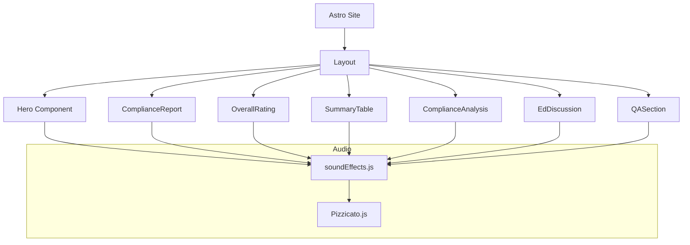

# Architecture Notes

This diagram shows how the main layout orchestrates each section of the page. The `soundEffects` module provides audio feedback to most components and relies on `Pizzicato.js` for Web Audio API primitives.
